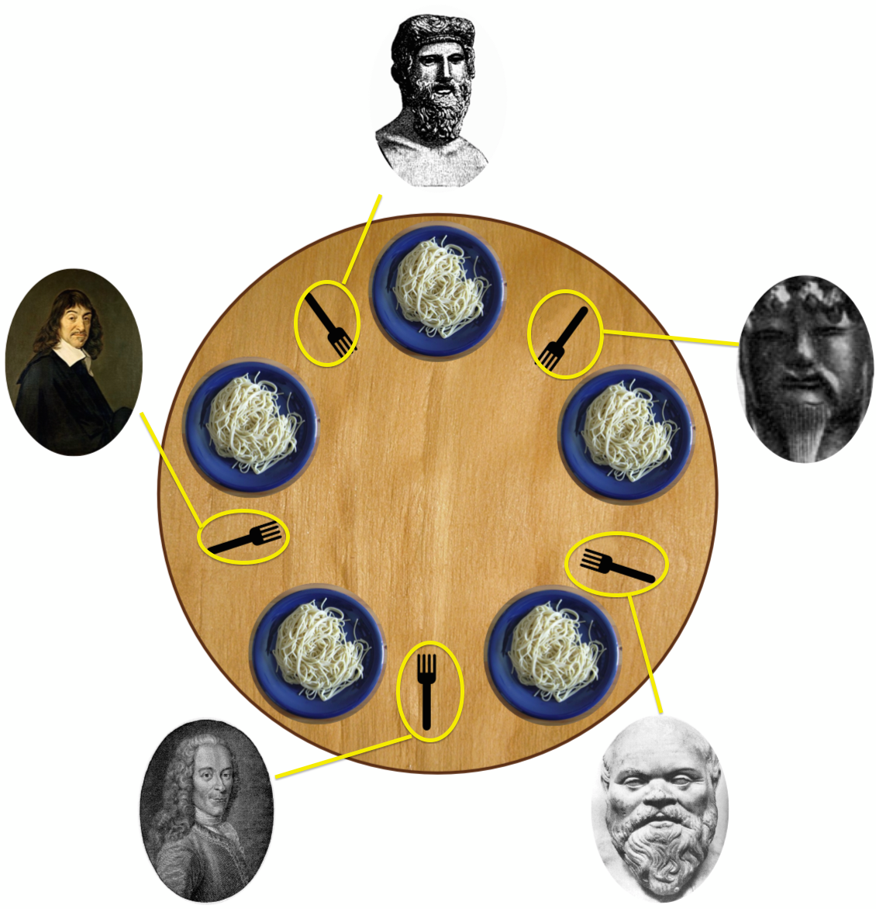

# **Philosophers**

This README provides an overview of the **Philo** project, detailing its objectives and offering guidance. The goal of the project is to implement a simulation of the classic Dining Philosophers problem in C, adhering to POSIX standards and best practices in multithreaded programming. It demonstrates synchronization techniques using POSIX threads (pthreads) and mutex locks to manage resource sharing among concurrent threads.



---
## **Table of Contents**
1. [Introduction](#introduction)
3. [Installation and Compilation](#installation-and-compilation)  
   - [Prerequisites](#prerequisites)  
   - [Clone the Repository](#clone-the-repository)  
   - [Build the Project](#build-the-project)  
4. [Running the Program](#running-the-program)  
   - [Command-Line Arguments](#command-line-arguments)  
   - [Example](#example)  
5. [Philo Features](#philo-features)  
   - [Multithreading](#multithreading)  
   - [Mutex Synchronization](#mutex-synchronization)  
   - [Argument Validation](#argument-validation)  
   - [Philosopher Lifecycle](#philosopher-lifecycle)  
   - [Logging and Monitoring](#logging-and-monitoring)  
   - [Memory Management](#memory-management)  
   - [Scalability and Flexibility](#scalability-and-flexibility)  
6. [Examples](#examples)  
   - [Basic Simulation](#1-basic-simulation)  
   - [Specifying Number of Times Each Philosopher Must Eat](#2-specifying-number-of-times-each-philosopher-must-eat)  
   - [Handling Invalid Arguments](#3-handling-invalid-arguments)  
   - [Memory Leak Check with Valgrind](#4-memory-leak-check-with-valgrind)  
7. [Conclusion](#conclusion)

---

## **Introduction**
Philo is a project designed to deepen your understanding of:
- **Multithreading and Concurrency:** Managing multiple threads using POSIX threads.
- **Synchronization Mechanisms:** Utilizing mutexes to prevent race conditions.
- **Process Coordination:** Simulating the Dining Philosophers problem to manage resource sharing.
- **Argument Parsing and Validation:** Handling user inputs robustly to ensure correct program behavior.
- **Memory Management:** Ensuring efficient use of memory and preventing leaks.

The primary objective is to create a simulation where philosophers alternately think, eat, and sleep, requiring the use of forks (represented by mutexes) to eat. This project emphasizes correct synchronization to avoid deadlocks and ensure that all philosophers can eventually eat.

## **Installation and Compilation**
Follow these steps to build and set up the Philo project on your local machine:

### **Prerequisites**
Ensure you have the following installed:
- **C Compiler:** GCC or a compatible C compiler.
- **POSIX-Compliant Environment:** Linux or macOS.
- **Make:** To facilitate the build process.

### **Clone the Repository**
Clone the repository to your local machine using Git:
```bash
git clone https://github.com/KartikPat250905/Philosophers
cd philo
```
Build the Project
Use the provided Makefile to compile the project:
```bash
make
```
This command will compile the necessary .c files and produce an executable named philo in the project directory.

---

## **Running the Program**
Once successfully compiled, you can launch Philo by running:
```bash
./philo [number_of_philosophers] [time_to_die] [time_to_eat] [time_to_sleep] [optional: number_of_times_each_philosopher_must_eat]
```
Command-Line Arguments:
1. **Number of Philosophers:** The total number of philosophers and forks.
2. **Time to Die (ms):** Time (in milliseconds) a philosopher can live without eating.
3. **Time to Eat (ms):** Time (in milliseconds) a philosopher spends eating.
4. **Time to Sleep (ms):** Time (in milliseconds) a philosopher spends sleeping.
5. **Number of Times Each Philosopher Must Eat (optional):** If all philosophers eat at least this many times, the simulation ends.

Example
```bash
./philo 5 2000 100 60
```
This command starts the simulation with five philosophers, each having 2000 ms to die without eating, 100 ms to eat, and 60 ms to sleep.

To specify the number of times each philosopher must eat:
```bash
./philo 5 2000 100 60 7
```

---

## **Philo Features**

### **Multithreading**
- **Concurrent Philosophers:** Each philosopher runs in its own thread, simulating parallel actions.
- **POSIX Threads:** Utilizes pthreads for efficient thread management.

### **Mutex Synchronization**
- **Fork Management:** Forks are protected by mutexes to prevent simultaneous access.
- **Deadlock Prevention:** Implements strategies to avoid deadlocks, ensuring smooth simulation.

### **Argument Validation**
- **Robust Input Handling:** Ensures all command-line arguments are valid and within expected ranges.
- **Clear Error Messages:** Provides descriptive errors for invalid inputs.

### **Philosopher Lifecycle**
- **Thinking, Eating, Sleeping:** Simulates the typical actions of philosophers with accurate timing.
- **Time Management:** Tracks and enforces time constraints for each action.

### **Logging and Monitoring**
- **Activity Logs:** Records significant events like fork acquisition, eating, and sleeping.
- **Thread-Safe Logging:** Ensures logs are correctly synchronized across threads.

### **Memory Management**
- **Dynamic Allocation:** Allocates resources based on the number of philosophers.
- **Leak Prevention:** Frees all allocated memory and destroys mutexes upon termination.

### **Scalability and Flexibility**
- **Variable Philosophers:** Supports different numbers of philosophers for customizable simulations.
- **Optional Eating Count:** Allows setting how many times each philosopher must eat before ending the simulation.

---

## **Examples**

### **1. Basic Simulation**

```bash
./philo 5 2000 100 60
```
Output:
```
[0 ms] Philosopher 1 has taken a fork.
[0 ms] Philosopher 1 is eating.
[0 ms] Philosopher 2 has taken a fork.
[0 ms] Philosopher 2 is eating.
...
```
### 2. Specifying Number of Times Each Philosopher Must Eat
```bash
./philo 5 2000 100 60 7
```
Output:
```
All philosophers have eaten at least 7 times. Simulation ends.
```
### 3. Handling Invalid Arguments
```bash
./philo -5 2000 100 60
```
Output:
```
Error: Invalid argument values.
```
### 4. Memory Leak Check with Valgrind
```bash
valgrind --leak-check=full ./philo 5 2000 100 60
```
Output:
```
==12345== Memcheck, a memory error detector
==12345== All heap blocks were freed -- no leaks are possible
...
```

---

## **Conclusion**
The **Philosophers** project serves as an in-depth exploration of multithreaded programming and synchronization in C. By simulating the Dining Philosophers problem, it provides practical experience in managing concurrent processes, utilizing mutexes for resource protection, and ensuring efficient memory management. This project not only reinforces theoretical concepts but also enhances problem-solving skills related to real-world programming challenges.